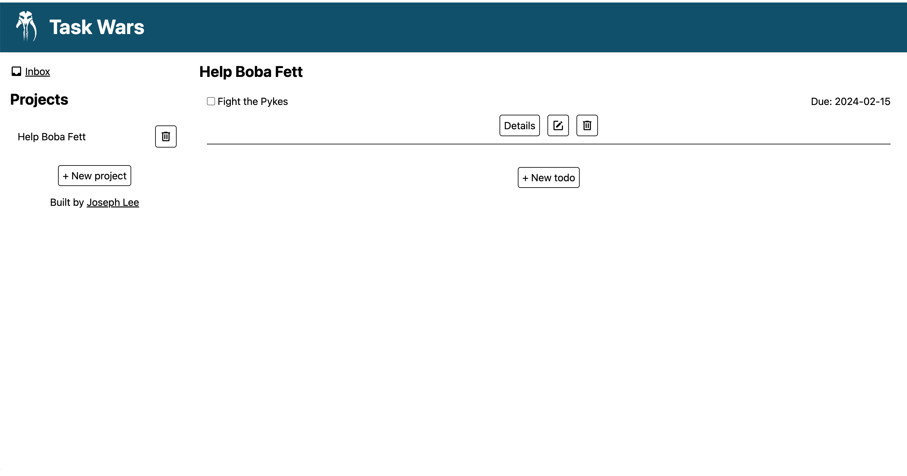

# Task Wars

My implementation of the [todo list project](https://www.theodinproject.com/lessons/node-path-javascript-todo-list) for [The Odin Project](https://www.theodinproject.com/). Try it [here](https://jooo-lee.github.io/task-wars/)!

## Description:

This todo list application helps users manage their tasks, with a flair of The Mandalorian from the Star Wars universe.

## Features:

-   CRUD functionality for todos
-   Todos store their title, description, due date and priority
-   Creation and deletion of projects to categorize todos
-   Data persistence using localStorage

## I learned how to:

-   Apply the "Single Responsibility Principle" of the SOLID principles
-   Use the "Abstraction Principle" of OOP to make functions and methods simple to use
-   Use the "Inheritance Principle" of OOP to reduce duplicate code for dialogs, modals and forms
-   Restore methods to objects after being stored in localStorage

## Future features:

-   Allow user to rename projects
-   Allow user to move todos to a different project
-   Sort todos by due date, priority, etc.

## Acknowledgements:

[Inbox icon](https://pictogrammers.com/library/mdi/icon/inbox/) and [trash can icon](https://pictogrammers.com/library/mdi/icon/trash-can-outline/) from [Pictogrammers](https://pictogrammers.com).

[Mythosaur logo](https://www.cleanpng.com/png-mobile-phones-smartphone-organization-mandalorian-5352778/) from [Clean PNG](https://www.cleanpng.com/).

[Grogu favicon](https://starwars.fandom.com/wiki/Din_Grogu?file=TheChild-Fathead.png) from [Wookieepedia](https://starwars.fandom.com/wiki/Main_Page).
